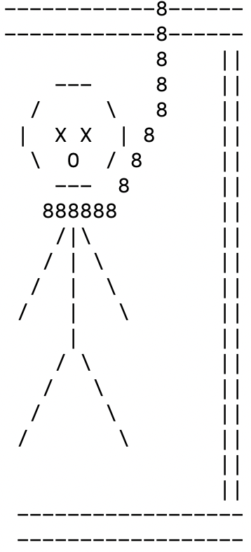

**HANGMAN**

This is Anna LaVergne's implementation of the [Odin Project's Hangman project](https://www.theodinproject.com/courses/ruby-programming/lessons/file-i-o-and-serialization-ruby-programming).

[Play Hangman in your browser here](https://repl.it/@annafirtree/Hangman?embed=1&output=1#main.rb). (Click the green Run arrow in the lower right corner once the page loads.)

If you are not familiar with the rules, Hangman is played by guessing an unknown word, one letter at a time. Each wrong letter gives you one more body part hanging from the hangman's rope. You win by guessing the word before you run out of body parts.

